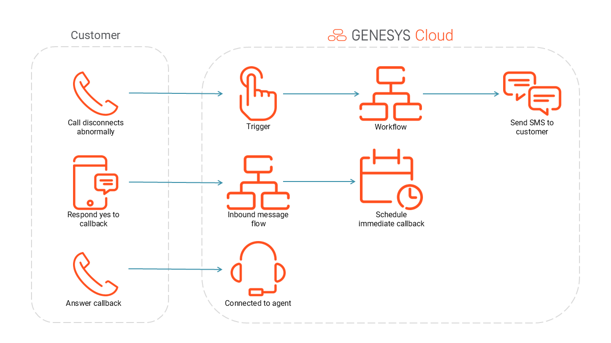

# Automatically offer callback for disconnetced voice interactions

This Blueprint consists of a defined trigger that looks for a voice call that has been disconnected abnormally. When triggered, a workflow will be executed which will send an SMS message to the caller where they can respond to receive a callback. If the caller responds for a callback, the inbound message flow will execute a data action which will schedule an immediate callback which will reconnect the caller to the agent.

