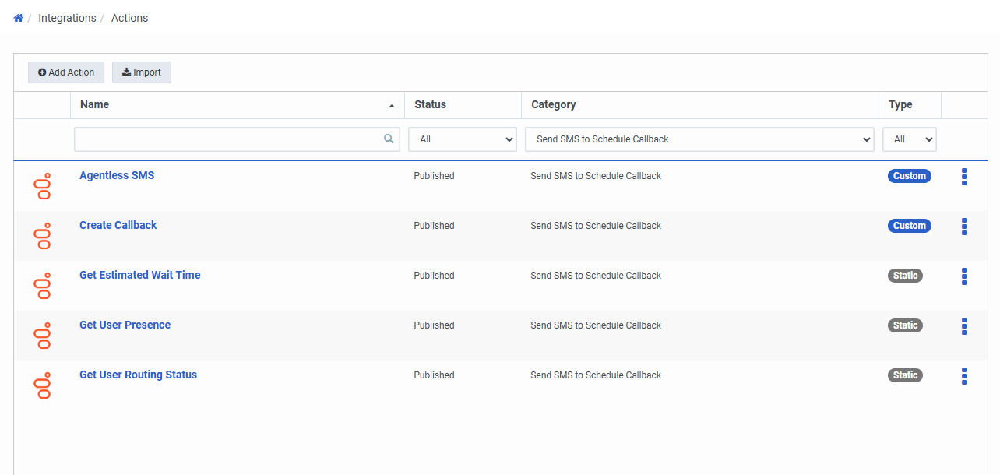
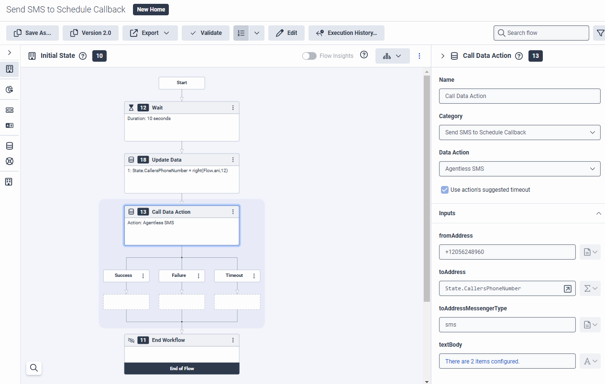
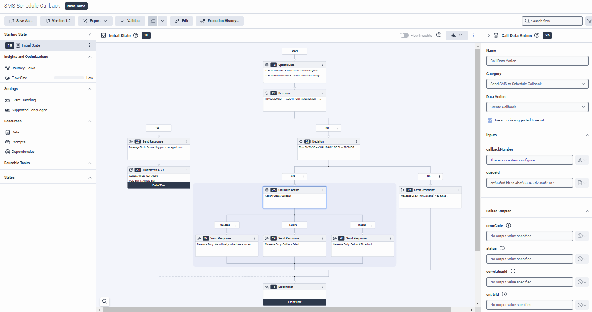
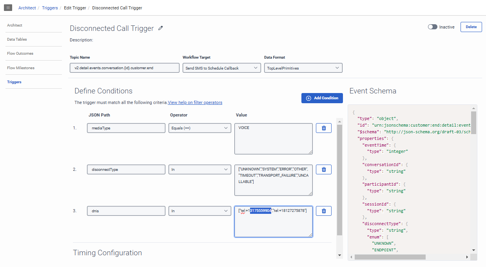

This Blueprint consists of a defined trigger that looks for a voice call that has been disconnected abnormally. When triggered, a workflow will be executed which will send an SMS message to the caller where they can respond to receive a callback. If the caller responds for a callback, the inbound message flow will execute a data action which will schedule an immediate callback which will reconnect the caller to the agent.


## Solution components

* **Genesys Cloud** - A suite of Genesys cloud services for enterprise-grade communications, collaboration, and contact center management. Contact center agents use the Genesys Cloud user interface.
* **Genesys Cloud API** - A set of RESTful APIs that enables you to extend and customize your Genesys Cloud environment.
* **Data Table** - Provides the ability to save blacklisted phone numbers from inbound calling.
* **Data Action** - Provides the integration point to invoke a third-party REST web service or AWS lambda.
* **Architect flows** - A flow in Architect, a drag and drop web-based design tool, dictates how Genesys Cloud handles inbound or outbound interactions.
* **Triggers** - Provides the ability for a data action and architect workflow to work cohisively to perform the task.

## Prerequisites

### Specialized knowledge

* Administrator-level knowledge of Genesys Cloud
* Expereince with REST API authentication

### Genesys Cloud account

* A Genesys Cloud CX 1 license. For more information, see [Genesys Cloud Pricing](https://www.genesys.com/pricing "Opens the Genesys Cloud pricing article").
* The Master Admin role in Genesys Cloud. For more information, see [Roles and permissions overview](https://help.mypurecloud.com/?p=24360 "Opens the Roles and permissions overview article") in the Genesys Cloud Resource Center.

## Implementation steps

You can implement Genesys Cloud objects manually or with Terraform.
* [Configure Genesys Cloud using Terraform](#configure-genesys-cloud-using-terraform)
* [Configure Genesys Cloud manually](#configure-genesys-cloud-manually)

### Download the repository containing the project files

Clone the [automatic-offer-callback-for-disconnected-call repository](https://github.com/GenesysCloudBlueprints/automatic-offer-callback-for-disconnected-call "Goes to the automatic-offer-callback-for-disconnected-call repository") in GitHub.

## Configure Genesys Cloud using Terraform

### Set up Genesys Cloud

1. Set the following environment variables in a terminal window before you run this project using the Terraform provider:

   * `GENESYSCLOUD_OAUTHCLIENT_ID` - This variable is the Genesys Cloud client credential grant Id that CX as Code executes against. 
   * `GENESYSCLOUD_OAUTHCLIENT_SECRET` - This variable is the Genesys Cloud client credential secret that CX as Code executes against. 
   * `GENESYSCLOUD_REGION` - This variable is the Genesys Cloud region in your organization.

2. Set the environment variables in the folder where Terraform is running. 

### Configure your Terraform build

* `client_id` - The value of your OAuth Client ID using Client Credentials to be used for the data action integration.
* `client_secret`- The value of your OAuth Client secret using Client Credentials to be used for the data action integration.
* `dnis` - The value of your configured DID Number with the format `tel:+11234567890`.
* `sms_number` - The purchased SMS number with the format `+11234567890`.
* `callback_queue` - The name of your configured queue for handling callbacks.
* `sms_queue` - The name of your configured queue for accepting SMS interactions.

The following is an example of the dev.auto.tfvars file.

```
client_id       = "your-client-id"
client_secret   = "your-client-secret"
dnis            = "tel:+10123456789"
sms_number      = "+11234567890"
callback_queue  = "callback-queue-name"
sms_queue       = "sms-queue-name"
```

### Run Terraform

The blueprint solution is now ready for your organization to use. 

1. Change to the **/terraform** folder and issue the following commands:

   * `terraform init` - This command initializes a working directory containing Terraform configuration files.  
   * `terraform plan` - This command executes a trial run against your Genesys Cloud organization and displays a list of all the Genesys Cloud resources Terraform created. Review this list and make sure that you are comfortable with the plan before you continue to the next step.
   * `terraform apply --auto-approve` - This command creates and deploys the necessary objects in your Genesys Cloud account. The `--auto-approve` flag provides the required approval before the command creates the objects.

After the `terraform apply --auto-approve` command successfully completes, you can see the output of the command's entire run along with the number of objects that Terraform successfully created. Keep the following points in mind:

   * This project assumes that you run this blueprint solution with a local Terraform backing state, which means that the `tfstate` files are created in the same folder where you run the project. Terraform recommends that you use local Terraform backing state files **only** if you run from a desktop or are comfortable deleting files.

   * As long as you keep your local Terraform backing state projects, you can tear down this blueprint solution. To tear down the solution, change to the `docs/terraform` folder and issue the  `terraform destroy --auto-approve` command. This command destroys all objects that the local Terraform backing state currently manages.

### SMS Number Configuration

Manually associate your purchased SMS Number to the Inbound Message Flow by following the steps [here](#associate-sms-number-to-inbound-message-flow).

## Configure Genesys Cloud manually

### Data Action

You will need to create a Genesys Cloud data action that will be used for sending SMS to schedule callbacks. This can be called "Send SMS to Schedule Callback". 

#### Create an OAuth client for use with a Genesys Cloud data action integration

To enable a Genesys Cloud data action to make public API requests on behalf of your Genesys Cloud organization, use an OAuth client to configure authentication with Genesys Cloud.

Create an OAuth client to use with the data action integration with a custom role.

To create an OAuth Client in Genesys Cloud:

1. Navigate to **Admin** > **Integrations** > **OAuth** and click **Add Client**.

2. Enter a name for the OAuth client and select **Client Credentials** as the grant type. Click the **Roles** tab and assign the required role for the OAuth client.

3. Click **Save**. Copy the client ID and the client secret values for later use.

   **Note:** Ensure that you **copy the client ID and client secret values** for each of the OAuth clients.

#### Add Genesys Cloud data action integration

Add a Genesys Cloud data action integration for each OAuth client being used with this blueprint to call the Genesys Cloud public API to:
* Send an agentless SMS
* Create a callback

To create a data action integration in Genesys Cloud:

1. Navigate to **Admin** > **Integrations** > **Integrations** and install the **Genesys Cloud Data Actions** integration. For more information, see [About the data actions integrations](https://help.mypurecloud.com/?p=209478 "Opens the About the data actions integrations article") in the Genesys Cloud Resource Center.

2. Enter a name for the Genesys Cloud data action, such as "Send SMS to Schedule Callback" in this blueprint solution.

3. On the **Configuration** tab, click **Credentials** and then click **Configure**.

4. Enter the client ID and client secret that you saved for the Public API (OAuth Client 1). Click **OK** and save the data action.

5. Navigate to the Integrations page and set the data action integration to **Active**.

   

#### Import the Genesys Cloud data actions

1. In Genesys Cloud, navigate to **Admin** > **Integrations** > **Actions** and click **Import**.
2. Select the `Agentless-SMS.json` and `Create-Callback.json` files and associate with "Send SMS to Schedule Callback" data action integration.
3. click **Import Action**.
4. Click **Save & Publish**

   

### Architect 

#### Import the Architect workflows

This solution includes one Architect workflow that uses one [data action](#add-genesys-cloud-data-action-integrations "Goes to the Add a web services data actions integration section"). 

* The **Send SMS to Schedule Callback.i3WorkFlow** workflow is triggered when a voice interaction has ended and has a disconnect type of `unknown`, `system`, `error`, `other`, `timeout`, `transport failure` and `uncallable`. This workflow calls a data action to send an agentless SMS to the customer.

* If the caller responds for a callback, the inbound message flow **SMS Schedule Callback.i3InboundMessage** will execute a data action which will schedule an immediate callback which will reconnect the caller to the agent.

First import this workflow to your Genesys Cloud organization:

1. Download the `Send SMS to Schedule Callback.i3WorkFlow` file from the [automatic-offer-callback-for-disconnected-call repo](https://github.com/GenesysCloudBlueprints/automatic-offer-callback-for-disconnected-call/tree/main/exports) GitHub repository.

2. In Genesys Cloud, navigate to **Admin** > **Architect** > **Flows:Workflow** and click **Add**.

3. Enter a name for the workflow and click **Create Flow**.

4. From the **Save** menu, click **Import**.

5. Select the downloaded **Send SMS to Schedule Callback.i3WorkFlow** file and click **Import**.

6. Click the `Call Data Action` step and use a purchased SMS number from your org in the `fromAddress` field.

7. Review your workflow. Click **Save** and then click **Publish**.

   **Note:** If you imported the `Send SMS to Schedule Callback.i3WorkFlow` file, your workflow will look like the flow below. 

   

#### Import the Inbound Message Flow

1. Download the `SMS Schedule Callback.i3InboundMessage` file from the [automatic-offer-callback-for-disconnected-call repo](https://github.com/GenesysCloudBlueprints/automatic-offer-callback-for-disconnected-call/tree/main/exports) GitHub repository.

2. In Genesys Cloud, navigate to **Admin** > **Architect** > **Flows:Inbound Message Flow** and click **Add**.

3. Enter a name for the inbound message flow and click **Create Flow**.

4. From the **Save** menu, click **Import**.

5. Select the downloaded **SMS Schedule Callback.i3InboundMessage** file and click **Import**.

6. Click the `Transfer to ACD` step and use a queue to accept SMS interactions.

7. Click the `Call Data Action` step and update `queueId` to use the Queue ID of the queue to handle voice callbacks.

8. Review your inbound message flow. Click **Save** and then click **Publish**.

   **Note:** If you imported the `SMS Schedule Callback.i3InboundMessage` file, your inbound message flow will look like the flow below. 

   

#### Associate SMS Number to Inbound Message Flow

1. Navigate to **Admin** > **Message** > **SMS Number Inventory** and click **Add Numbers**.
2. Add the `SMS Schedula Callback` as an Associated Flow.

:::primary
To purchase an SMS number, you will need to  follow the [Required regulatory documentation for SMS number purchase](https://help.mypurecloud.com/?p=213152).
:::

### Triggers

Create the trigger that invokes the created Architect workflow.

1. In Genesys Cloud, navigate to **Admin** > **Architect** > **Triggers**.

2. From the Triggers list, click **Add Trigger**.

3. From the Add New Trigger modal, name your trigger and click **Add**.

4. From the Trigger single view input **Topic Name**, **Workflow Target**, and **Data Format** as mentioned in the table below.  

  | Topic Name | Workflow Target | Data Format |
  |---------------------------------------------------|-----------|--------------------|
  | v2.detail.events.conversation.{id}.customer.end | Send SMS to Schedule Callback | TopLevelPrimitives |

5. Click **Add Condition**.  
   NOTE: For more information, see [Available Topics](https://developer.genesys.cloud/notificationsalerts/notifications/available-topics "Opens the Available Topics article") in the Genesys Cloud Developer Center. Using the notification monitoring tool in the Developer Center, you can watch the notifications happen.

6. From the Trigger single view, input **JSON Path**, **Operator**, and **Value** as mentioned in the table below. 

  | JSON Path | Operator | Value |
  |------------|-----------------|-------------|
  | mediaType | Equals(==) | VOICE |
  | disconnectType | In | ["UNKNOWN","SYSTEM","ERROR","OTHER","TIMEOUT","TRANSPORT_FAILURE","UNCALLABLE"] |
  | dnis | In | ["tel:+11234567890","tel:+10123456789"] |
  
  NOTE: Add your configured DID Number in the DNIS field with the format `tel:+11234567890`.

7. Click **Save**.

   

## Additional resources

* [Genesys Cloud API Explorer](https://developer.genesys.cloud/devapps/api-explorer "Opens the GC API Explorer") in the Genesys Cloud Developer Center
* [Genesys Cloud notification triggers](https://developer.genesys.cloud/notificationsalerts/notifications/available-topics "Opens the Available topics page") in the Genesys Cloud Developer Center
* The [automatic-offer-callback-for-disconnected-call](https://github.com/GenesysCloudBlueprints/automatic-offer-callback-for-disconnected-call) repository in GitHub
